<div align="center">


# Zotero Prism · 棱镜

**为 Zotero 提供文库可视化、AI 问答、全文翻译与阅读管理**

<sub>Reading analytics, an AI copilot and full-text translation for Zotero.</sub>

[](LICENSE)
[](https://www.zotero.org/)
[](#免责声明)

[安装](#安装) · [功能](#功能) · [快捷键](#快捷键) · [设置](#设置) · [关于](#关于) · [免责声明](#免责声明)

</div>

> [!IMPORTANT]
> **本插件免费开源，发布和使用均不收取任何费用。**
> 官方发布渠道仅有本仓库及其 [Releases 页面](https://github.com/mxlapan/zotero-prism/releases)，其他来源的安装包均非作者发布。

<table>
<tr>
<td width="50%" valign="top">
<a href="#spectrum--文库可视化">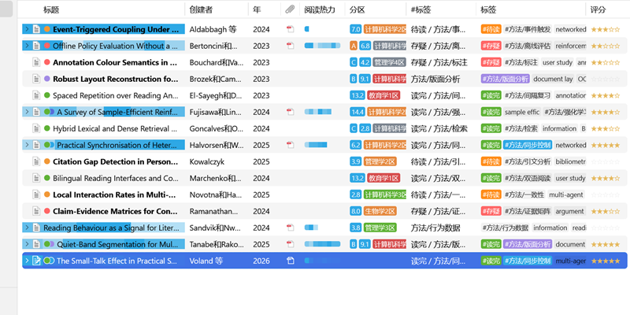</a>
<p><b>Spectrum · 文库可视化</b><br />阅读热力、期刊分区、被引数、评分、关系图谱、标注管理</p>
</td>
<td width="50%" valign="top">
<a href="#lens--ai-助手">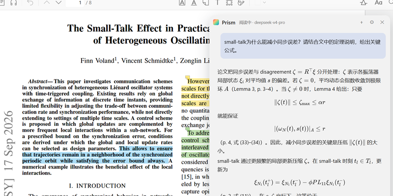</a>
<p><b>Lens · AI 助手</b><br />浮窗问答、阅读器侧边栏、划词解释、AI 笔记、语义检索</p>
</td>
</tr>
<tr>
<td width="50%" valign="top">
<a href="#refract--翻译">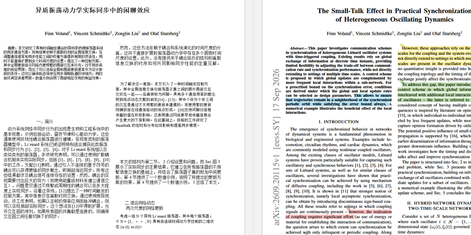</a>
<p><b>Refract · 翻译</b><br />阅读器内全文翻译，译文保持原文版式；另有划词翻译与双语对照笔记</p>
</td>
<td width="50%" valign="top">
<a href="#beam--阅读管理">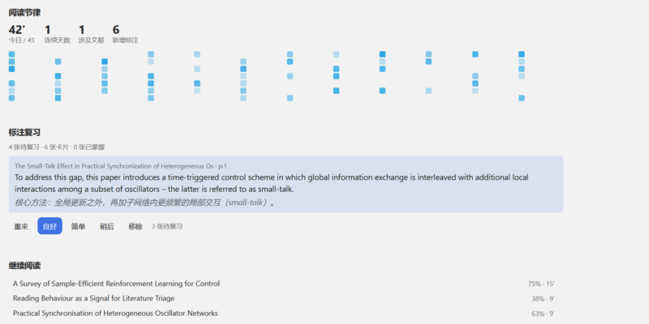</a>
<p><b>Beam · 阅读管理</b><br />阅读节律、标注复习、引文缺口、观点矩阵、新文追踪</p>
</td>
</tr>
</table>

四个模块均可在设置中单独关闭。

## 安装

1. 从 [Releases](https://github.com/mxlapan/zotero-prism/releases) 下载最新的 `zotero-prism.xpi`
2. 在 Zotero 中打开「工具 → 插件」，点击右上角的 ⚙，选择「Install Add-on From File」，选中下载的文件即可

支持 Zotero 7、8、9、10。

<details>
<summary>从源码构建</summary>

```bash
npm install
npm run build
npm start
```

</details>

## 功能

### Spectrum · 文库可视化

为文库列表增加阅读热力、期刊分区、被引数等列，并提供条目面板、标注管理与关系图谱。

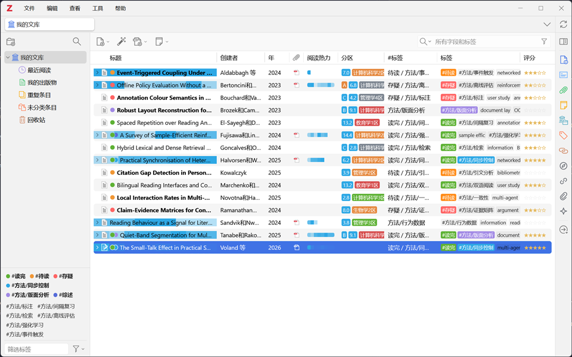

<sub>标题底色表示每一页的阅读停留时长，停留越久颜色越深；未读条目以粗体显示。</sub>

- **阅读热力**：按页记录停留时长，仅在窗口处于前台时计时；既可显示为标题底色，也可单独成列
- **期刊分区**：使用 easyScholar 完整数据集；未配置密钥时，改用内置分区表（涵盖 CCF、中科院分区及 JCR 常见期刊）
- **被引数**：数据来自 Semantic Scholar、OpenAlex 与 Crossref，首选数据源不可用时自动切换
- **标签分列**：「标签」列显示全部标签，「#标签」列仅显示以 `#` 开头的标签。导入元数据时常附带大量关键词，分列之后，自建标签不会被淹没

<table>
<tr>
<td width="50%" valign="top">

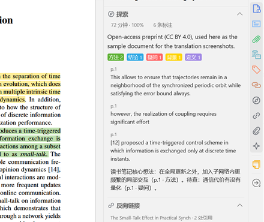

**条目面板**：「探索」分区显示阅读时长、覆盖率与按颜色统计的标注；另有「反向链接」（引用了本文标注的笔记）与「附件」两个分区。

</td>
<td width="50%" valign="top">

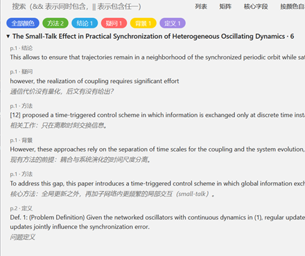

**标注管理**（`Ctrl/Cmd + Shift + H`）：汇总全部文献的标注，支持按颜色筛选与 `&&` / `||` 组合搜索，点击即可跳转至原文。

</td>
</tr>
</table>

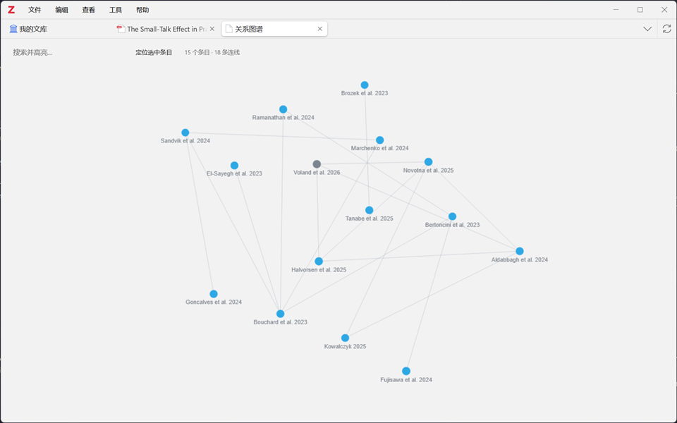

<sub>关系图谱（工具 → 棱镜 Prism → 关系图谱）：连线依据 Zotero 的「相关条目」、共有标签与已获取的引文关系。标签越少见，连线越强；被三成以上条目共用的标签（如阅读状态）不参与连线。</sub>

<details>
<summary>其他功能</summary>

| 功能 | 说明 |
| --- | --- |
| 评分列 | 点击第 N 颗星即评 N 分，再次点击清除 |
| 未读加粗 | 阅读时长不足 90 秒视为未读，也可手动标记 |
| 标注密度列 | 以条形图显示每页的标注字数 |
| #标签规则 | 支持 `#` 前缀（显示时去除 `#`）、`~` 排除与 `/^#(.+)/` 正则，并可用 `from=to,` 重命名 |
| 被引数细分 | 将 Semantic Scholar 的被引数细分为 Highly Influential / Background / Methods / Results |
| 嵌套标签 | 以 `#方法/问卷` 的形式组成标签树，点击筛选，右键可重命名或删除整个分支 |
| 视图组 | 保存、切换与删除列布局（工具 → 棱镜 Prism → 视图组） |
| 快速筛选 | 按条目类型筛选（工具 → 棱镜 Prism → 快速筛选），清除筛选时一并删除临时检索 |
| 标签组 | 将当前打开的阅读标签页保存为命名组，之后可一键恢复 |
| 文献矩阵 | 按颜色或标签规则将多篇文献的标注整理成表格，可导出为笔记或生成 AI 综述 |
| 标注颜色命名 | 为每种高亮颜色命名，文献矩阵与 AI 功能均使用该名称 |
| 附件分区 | 打开附件、在新窗口中打开、预览首页文本 |

</details>

### Lens · AI 助手

在 Zotero 中直接向大模型提问。浮窗、阅读器侧边栏与划词弹窗均可使用，回答可保存为笔记。

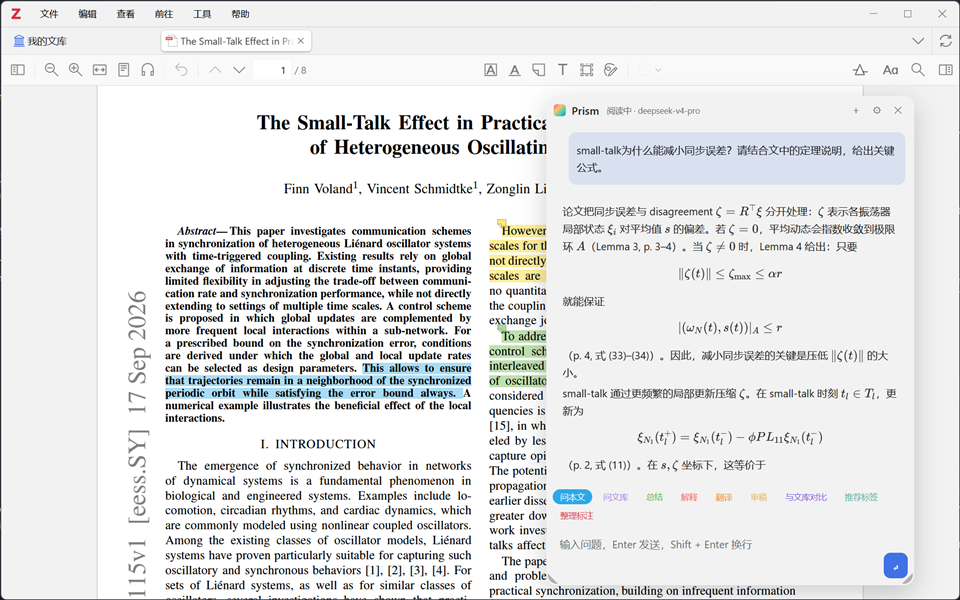

<sub>浮窗问答（`Ctrl/Cmd + /`），选择「问本文」后提问。发送给模型的全文附有页码标记，因此回答中的 (p. N) 与原文页码一致；公式以 LaTeX 渲染。</sub>

<table>
<tr>
<td width="50%" valign="top">

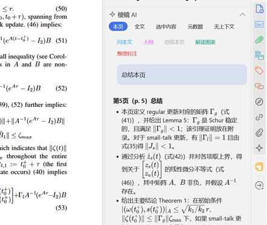

**阅读器侧边栏**：上方选择上下文（本页 / 全文 / 选中内容 / 元数据 / 无上下文），下方为快捷命令。图为在第 5 页执行「总结本页」的结果。

</td>
<td width="50%" valign="top">

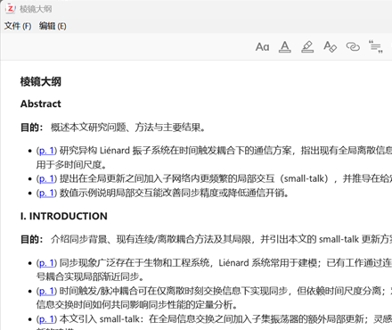

**AI 大纲笔记**：右键条目，选择「棱镜 Prism → AI 大纲 → 笔记」。每条要点前的页码均可点击，跳转至 PDF 对应页。

</td>
</tr>
</table>

- **划词弹窗**：翻译、解释、追问；回答可写入 PDF 标注的评论
- **AI 笔记**：总结、大纲、按模板填写笔记（兼容 Better Notes 模板）、文献鸟瞰（生成 Markdown 文件，可在 Obsidian 中打开）、推荐标签；生成完成后自动打开
- **AI 标注**：由模型挑选关键句，在 PDF 上生成真实的高亮标注；无法定位的句子改为页内便签
- **语义检索**：在本地建立索引，结合向量检索与 BM25；未配置 Embedding 或尚未建立索引时，改用关键词检索
- **回答存档**：一键保存为子笔记，同时记录所用模型、提示词与来源；也可追加到当前笔记
- **模型接入**：支持 OpenAI / DeepSeek / 硅基流动 / Kimi / 智谱 / Ollama / LM Studio / 中转服务及 Anthropic，可保存多套配置
- **网页联动**：安装插件自带的浏览器扩展后，在已登录的 ChatGPT / Claude / Gemini / 豆包 / Kimi / DeepSeek / 通义 / 元宝 / 智谱网页中点击「Connect」，即可通过网页版问答

<details>
<summary>自定义提示词</summary>

内置 12 条提示词，也可自行添加。提示词中的 `${...}` 会作为 JavaScript 执行，例如：

```
回答下面这篇论文的问题，引用时标注页码。

问题：${P.question}

--- 论文 ---
${await P.fullText()}
```

可用变量与函数：`P.question` `P.selection` `P.item` `P.items` `P.meta()` `P.abstract()`
`await P.fullText()` `await P.pageText()` `await P.pages(3,6)` `await P.annotations()`
`await P.search(q)` `await P.libraryTags()` `P.itemsMeta()`，以及 `Zotero`、`ZoteroPane` 对象。

</details>

### Refract · 翻译

在阅读器中将整篇 PDF 译为中文。译文逐行对应原文位置，分栏、行距与缩进保持不变。

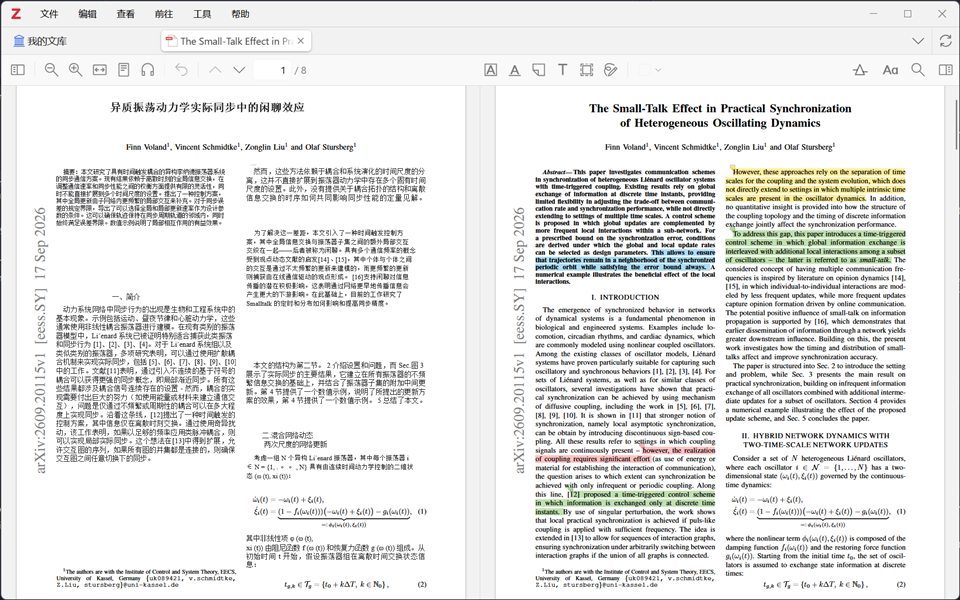

<sub>按 `Ctrl/Cmd + Shift + B` 开始翻译或切换回原文。图为「并排对照原文」模式：左侧为译文，右侧为原文及你的高亮，两侧同步翻页。</sub>

<table>
<tr>
<td width="50%" valign="top">

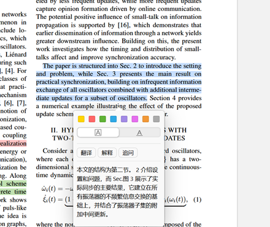

**划词翻译**：选中文字后，在弹出的选区菜单中点击「翻译」。

</td>
<td width="50%" valign="top">

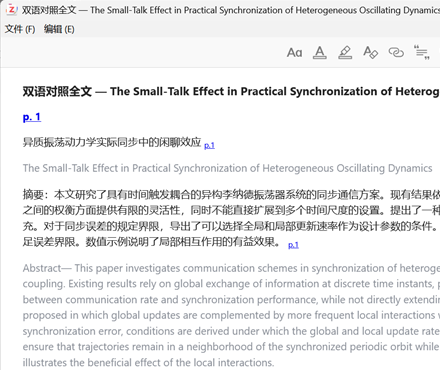

**双语对照笔记**：逐段中英对照，每段附有页码链接，点击即可跳回 PDF。

</td>
</tr>
</table>

- **仅译正文**：页眉页脚、期刊名、DOI、版权声明、邮箱、作者与单位、页码及表格数据均保留原文（可关闭）
- **跳过公式与参考文献**：公式整块跳过；自 References 起至文末均不翻译
- **9 种翻译引擎**：Google（免费）、DeepL、DeepLX、微软、百度、有道、小牛、LibreTranslate，以及你配置的 AI 模型；某一引擎出错时，剩余段落自动改由其他免密钥引擎完成
- **标题与摘要批量翻译**：结果可保存为笔记、追加到摘要或写入 Extra 字段
- **版面重建服务**（可选）：调用 pdf2zh / MinerU / Doc2X 生成重新排版的译文 PDF，并附加到条目下

<details>
<summary>排版与断句细节</summary>

- 分栏位置由三类信号共同判定（行的投票、空白通道、栏的起始位置），两栏基线不齐或标题横跨整页时同样适用
- 被分栏或换页截断的段落，先拼接成完整句子再送翻译，连字符自动接合，译文再按原比例分回两处
- 编号列表的悬挂缩进不会被误判为新段落；旋转排版的文字（如 arXiv 页边编号）不参与排版
- 空间不足时自动缩小字号，中文断行遵循避头尾规则；字号、行距与字体均可调整
- 对照笔记可选择逐段或逐句配对；逐句模式下仍按段落发送请求，避免免费引擎因上千次请求而变慢
- 按住 `Ctrl/Cmd` 点击可查看单个文本块的原文；译文缓存在本地，再次打开无需重新请求

</details>

### Beam · 阅读管理

统计阅读情况，安排标注复习，查找文库中缺少的文献，并追踪新发表的论文。

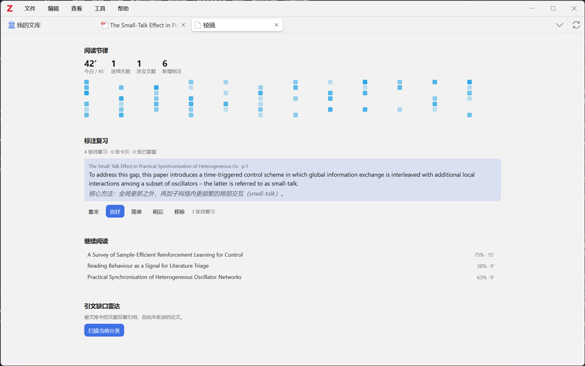

<sub>仪表盘（`Ctrl/Cmd + Shift + D`）：阅读节律、今日待复习的卡片、「继续阅读」书架与引文缺口雷达。</sub>

| 功能 | 说明 |
| --- | --- |
| **阅读节律** | 今日阅读分钟数、连续阅读天数、近 12 周的活跃热力图，以及「继续阅读」书架 |
| **标注复习** | 新标注自动加入复习队列，按 1、3、7、16、35、90 天的间隔出现；点击卡片即可跳转到对应页 |
| **引文缺口雷达** | 统计被你的文献反复引用、而文库中尚未收录的论文，可按 DOI 一键导入 |
| **观点 × 证据矩阵** | 由 AI 提取论点，再逐篇判断文献对其支持、反驳、不明确或未涉及 |
| **新文追踪** | 追踪某篇文献的新增引用或某个 arXiv 检索式，有新结果时生成一篇摘要笔记 |

## 快捷键

| 快捷键 | 功能 |
| --- | --- |
| `Ctrl/Cmd + /` | 浮窗问答 |
| `Ctrl/Cmd + Shift + D` | 仪表盘 |
| `Ctrl/Cmd + Shift + H` | 标注管理 |
| `Ctrl/Cmd + Shift + B` | 全文翻译 / 切换原文（B 即 bilingual） |

## 设置

<p align="center">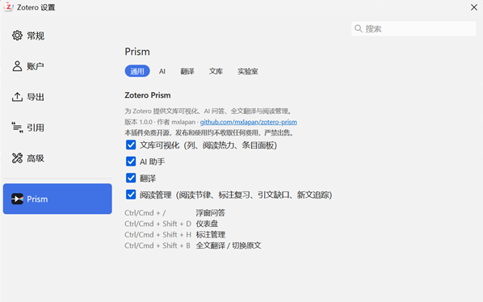</p>

位于「设置 → Prism」，共分五页：

| 分页 | 内容 |
| --- | --- |
| 通用 | 各模块开关、快捷键一览 |
| AI | 模型、密钥、温度、系统提示词、配置档、Embedding、索引、网页联动、提示词库 |
| 翻译 | 引擎与密钥、目标语言、仅译正文、跳过公式、并发数、覆盖层排版、版面重建服务 |
| 文库 | 列开关、热力颜色、#标签规则、分区数据与 easyScholar 密钥、被引数据源、颜色命名 |
| 实验室 | 阅读目标、复习节奏、缺口阈值、追踪列表 |

<details>
<summary>数据存放位置</summary>

| 位置 | 内容 |
| --- | --- |
| `<数据目录>/prism/reading.json` | 每页阅读时长 |
| `<数据目录>/prism/rhythm.json` | 每日统计 |
| `<数据目录>/prism/review.json` | 复习卡片 |
| `<数据目录>/prism/index.json` | 语义索引 |
| `<数据目录>/prism/references.json` | 参考文献缓存 |
| `<数据目录>/prism/citations.json` `ranks.json` `translation-cache.json` | 被引、分区与翻译缓存 |
| Zotero 同步设置 | 标注颜色命名 |
| 条目的 Extra 字段 | `prism-rating` / `prism-read` |

</details>

<details>
<summary>代码结构</summary>

```
src/
├── lib/            markdown（markdown-it + KaTeX + hljs）、向量索引、力导向图
├── utils/          偏好、存储、HTTP（含 SSE 流式）、文本切分、条目与 PDF 访问、DOM
└── modules/
    ├── spectrum/   列、阅读计时、被引、分区、颜色、标注管理、面板分区、图谱、标签页
    ├── lens/       模型接入、网页联动、提示词、检索、对话、浮窗、侧边栏、AI 应用
    ├── refract/    翻译引擎、版面分析、覆盖层、元数据翻译、版面重建服务
    ├── beam/       复习、引文缺口、观点矩阵、追踪、仪表盘
    ├── reader.ts   阅读器集成（划词、工具栏、右键菜单、阅读计时）
    ├── menus.ts    菜单
    ├── keys.ts     快捷键
    └── prefsPane.ts 设置界面
```

</details>

## 关于

Zotero Prism（棱镜）由 mxlapan 开发，使用 TypeScript 编写。

插件不含广告，不做推广。源代码全部公开，欢迎审阅与指正；问题与建议请提交至 [Issues](https://github.com/mxlapan/zotero-prism/issues)。

本页截图均取自专门的演示文库：条目为虚构数据，阅读器中的 PDF 是一篇以 CC BY 4.0 协议发布的 arXiv 论文；AI 截图中的回答由 deepseek-v4-pro 生成，未作修改。

## 免责声明

**一、免费原则**

本插件没有付费版本，也不发放激活码或会员资格。作者拒绝任何个人或机构以任何形式出售本插件，包括原样或修改后出售、捆绑进付费产品或付费社群；严禁将本插件用于商业牟利。

**二、合法使用原则**

使用本插件翻译和处理文献时，请遵守所在地的法律法规、文献的版权与许可条款，以及所调用的翻译服务和大模型服务的使用条款。

**三、免责原则**

本插件按现状提供，不附带任何形式的担保。AI 生成的回答、摘要、标签与译文可能存在错误，引用前请核对原文。因使用本插件造成的数据丢失或其他后果，作者不承担责任；建议定期备份 Zotero 数据目录。

**四、安全原则**

作者保证经官方渠道发布的安装包不含恶意代码，也不含任何统计或数据收集代码。插件仅在执行你发起或设定的任务时联网：查询被引数、分区、参考文献与新文时，发送 DOI、arXiv 编号、标题或刊名；翻译、提问与建立语义索引时，发送相应的文本。发送对象仅限于[致谢](#致谢)中列出的数据来源，以及你在设置中选定的翻译与模型服务。API 密钥仅保存在本机的 Zotero 偏好中。对于第三方修改或转发的版本，作者不作任何保证。

## 许可证

本项目以 [AGPL-3.0-or-later](LICENSE) 协议开源，Copyright © 2026 mxlapan。名称与图标的使用说明见 [NOTICE.md](NOTICE.md)。

## 致谢

- [zotero-plugin-toolkit](https://github.com/windingwind/zotero-plugin-toolkit) / [zotero-plugin-scaffold](https://github.com/northword/zotero-plugin-scaffold)
- Zotero 插件生态中已有许多优秀作品，它们的设计为本项目带来了诸多启发
- 数据来源：Semantic Scholar、OpenAlex、Crossref、arXiv、easyScholar
